#  AWS NAT Gateway

A complete step-by-step walkthrough for configuring **NAT Gateways** in Amazon Web Services, enabling outbound internet access for EC2 instances in private subnets while keeping them protected from inbound connections.


---

## Table of Contents

- [Overview](#overview)
- [Architecture](#architecture)
- [Prerequisites](#prerequisites)
- [Setup Process](#setup-process)
  - [1. Create a VPC](#1-create-a-vpc)
  - [2. Create the Public Subnet](#2-create-the-public-subnet)
  - [3. Create the Private Subnet](#3-create-the-private-subnet)
  - [4. Enable Auto-Assign Public IP on the Public Subnet](#4-enable-auto-assign-public-ip-on-the-public-subnet)
  - [5. Create an Internet Gateway](#5-create-an-internet-gateway)
  - [6. Attach the Internet Gateway to the VPC](#6-attach-the-internet-gateway-to-the-vpc)
  - [7. Create the Public Route Table](#7-create-the-public-route-table)
  - [8. Add the Internet Gateway Route](#8-add-the-internet-gateway-route)
  - [9. Associate the Public Subnet with the Public Route Table](#9-associate-the-public-subnet-with-the-public-route-table)
  - [10. Create the NAT Gateway](#10-create-the-nat-gateway)
  - [11. Update the Private Route Table](#11-update-the-private-route-table)
  - [12. Launch EC2 Instances](#12-launch-ec2-instances)
  - [13. Connect to Public Instance & Verify NAT](#13-connect-to-public-instance--verify-nat)
- [Resource Summary](#resource-summary)
- [Cleanup](#cleanup)
- [Key Concepts](#key-concepts)
- [Resources](#resources)

---

## Overview

A **NAT (Network Address Translation) Gateway** is a managed AWS service that allows instances in a **private subnet** to initiate outbound connections to the internet or other AWS services, while preventing the internet from initiating inbound connections to those instances.

| Feature | Description |
|---|---|
| **Outbound Access** | Private instances can reach the internet for updates, patches, and API calls |
| **Inbound Protection** | Internet cannot directly connect to private instances |
| **AWS Service Connectivity** | Private instances can communicate with AWS services (S3, SSM, etc.) |
| **Managed & Highly Available** | AWS handles availability, scaling, and maintenance automatically |

---

## Architecture

```
Internet
    │
    ▼
Internet Gateway (MyIGW)
    │
    ▼
┌──────────────────────────────────────────────────┐
│               MyVPC  (10.0.0.0/16)               │
│                                                  │
│  ┌───────────────────────────────────────────┐   │
│  │    MyPublicSubnet  (10.0.0.0/24)          │   │
│  │                                           │   │
│  │   ┌─────────────────┐  ┌──────────────┐   │   │
│  │   │ MyPublicServer  │  │ NAT Gateway  │   │   │
│  │   │  (t2.micro)     │  │ (MyNATGW)    │   │   │
│  │   └─────────────────┘  └──────┬───────┘   │   │
│  └───────────────────────────────│───────────┘   │
│                    outbound only │               │
│  ┌────────────────────────────── │ ──────────┐   │
│  │    MyPrivateSubnet (10.0.1.0/24)          │   │
│  │                               │           │   │
│  │   ┌──────────────────────┐    │           │   │
│  │   │  MyPrivateServer     │────┘           │   │
│  │   │     (t2.micro)       │  via main RTB  │   │
│  │   └──────────────────────┘                │   │
│  └───────────────────────────────────────────┘   │
└──────────────────────────────────────────────────┘
```

**Traffic Flow:**
- Public instance → Internet Gateway → Internet 
- Private instance → NAT Gateway → Internet Gateway → Internet 
- Internet → Private instance (blocked)

---

## Prerequisites


- An active **AWS account**
- Sufficient **IAM permissions** to create VPCs, subnets, gateways, route tables, and EC2 instances
- A **key pair** created in EC2 for SSH access


---

## Setup Process

### 1. Create a VPC

1. Navigate to **VPC → Your VPCs → Create VPC**
2. Select **VPC only**
3. Configure:
   - **Name tag:** `MyVPC`
   - **IPv4 CIDR:** `10.0.0.0/16`
   - **Tenancy:** Default
4. Click **Create VPC**

>  You should see a green success banner: *"You successfully created vpc-xxxx / MyVPC"*

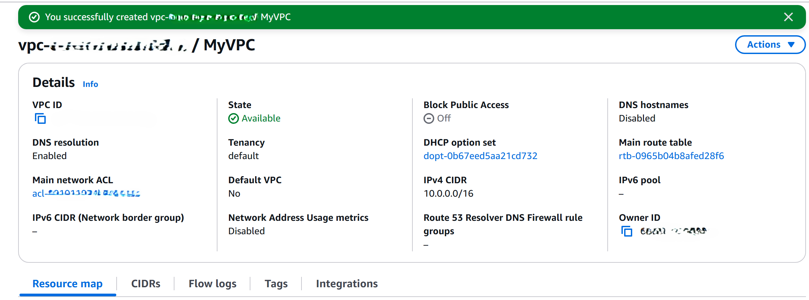

---

### 2. Create the Public Subnet

1. Navigate to **VPC → Subnets → Create Subnet**
2. Select **MyVPC** from the VPC dropdown
3. Configure subnet settings:
   - **Subnet name:** `MyPublicSubnet`
   - **Availability Zone:** No preference
   - **IPv4 CIDR block:** `10.0.0.0/24`
4. Click **Create subnet**

> You should see: *"You have successfully created 1 subnet: subnet-xxxx"*

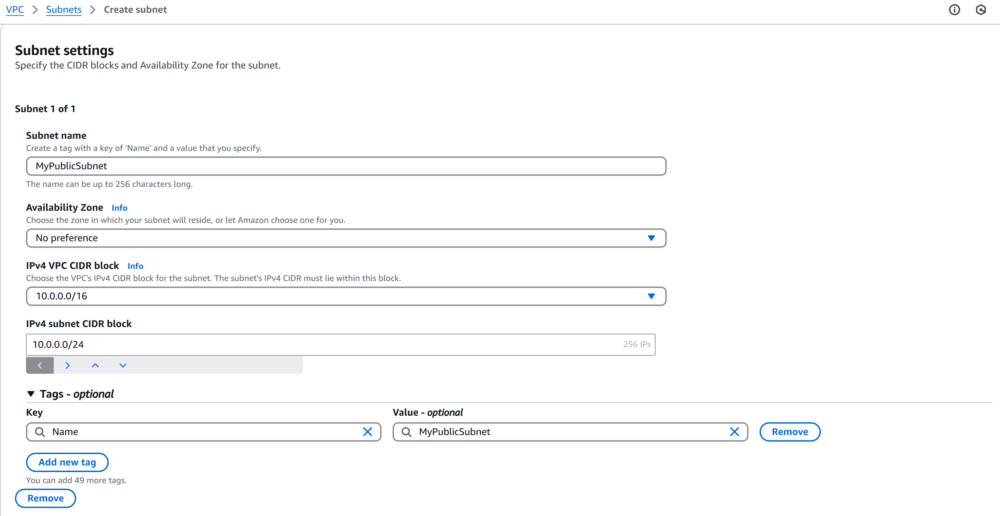

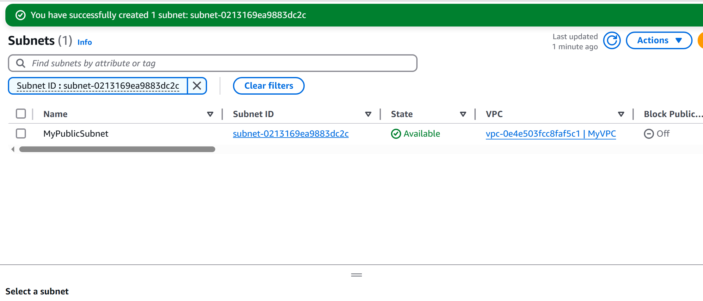

---

### 3. Create the Private Subnet

1. Navigate to **VPC → Subnets → Create Subnet**
2. Select **MyVPC** from the VPC dropdown
3. Configure subnet settings:
   - **Subnet name:** `MyPrivateSubnet`
   - **Availability Zone:** No preference
   - **IPv4 CIDR block:** `10.0.1.0/24`
4. Click **Create subnet**

> You should see: *"You have successfully created 1 subnet: subnet-xxxx"*

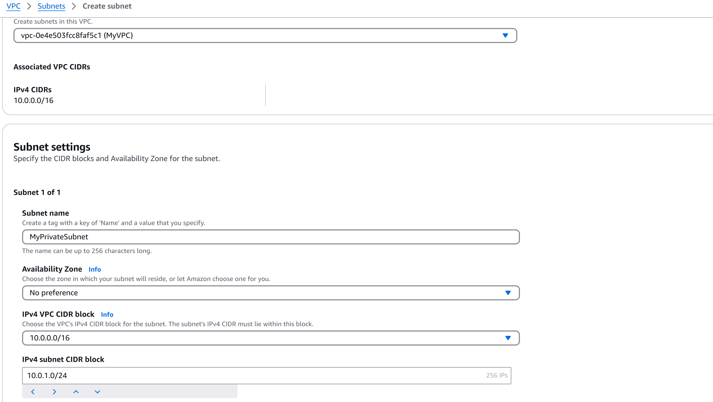

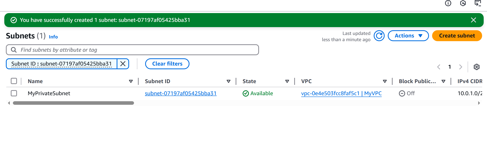

---

### 4. Enable Auto-Assign Public IP on the Public Subnet

1. Select **MyPublicSubnet** from the Subnets list
2. Click **Actions → Edit subnet settings**
3. Check **Enable auto-assign public IPv4 address**
4. Click **Save**

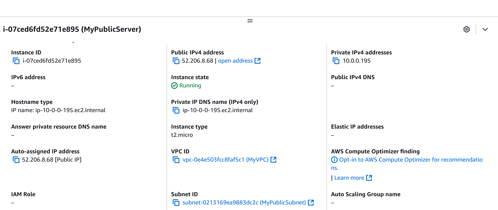

---

### 5. Create an Internet Gateway

1. Navigate to **VPC → Internet Gateways → Create internet gateway**
2. Configure:
   - **Name tag:** `MyIGW`
3. Click **Create internet gateway**

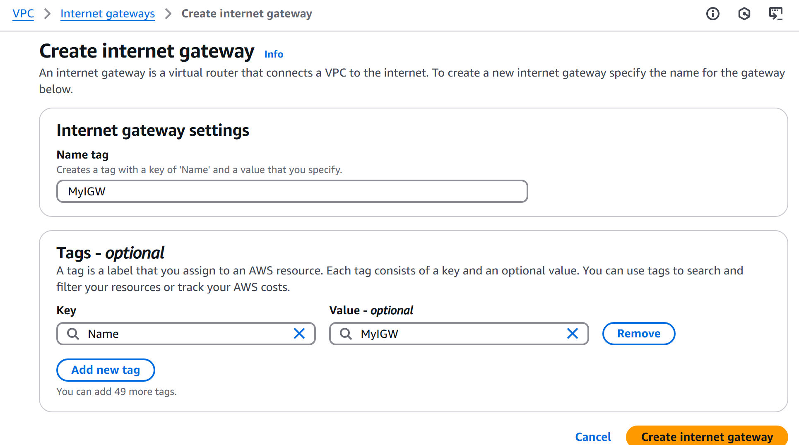

> The gateway is created with state **Detached** you must attach it to the VPC next.

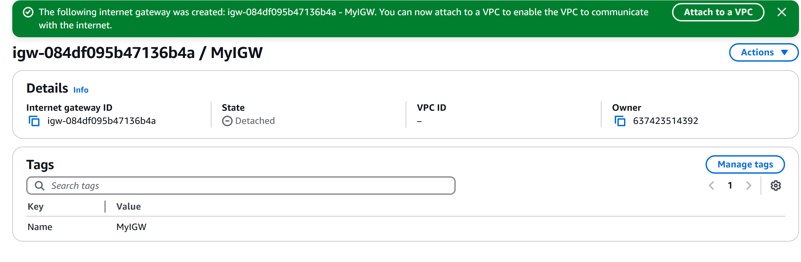

---

### 6. Attach the Internet Gateway to the VPC

1. From the Internet Gateway detail page, click **Attach to a VPC** (or **Actions → Attach to VPC**)
2. Select **MyVPC**
3. Click **Attach internet gateway**

> You should see: *"Internet gateway igw-xxxx successfully attached to vpc-xxxx"* and the state changes to **Attached**.

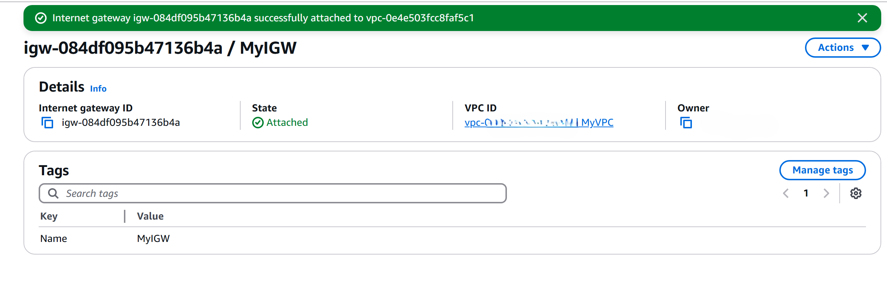

---

### 7. Create the Public Route Table

1. Navigate to **VPC → Route Tables → Create route table**
2. Configure:
   - **Name:** `PublicRouteTable`
   - **VPC:** `MyVPC`
3. Click **Create route table**

> The route table is created with a single local route (`10.0.0.0/16 → local`).

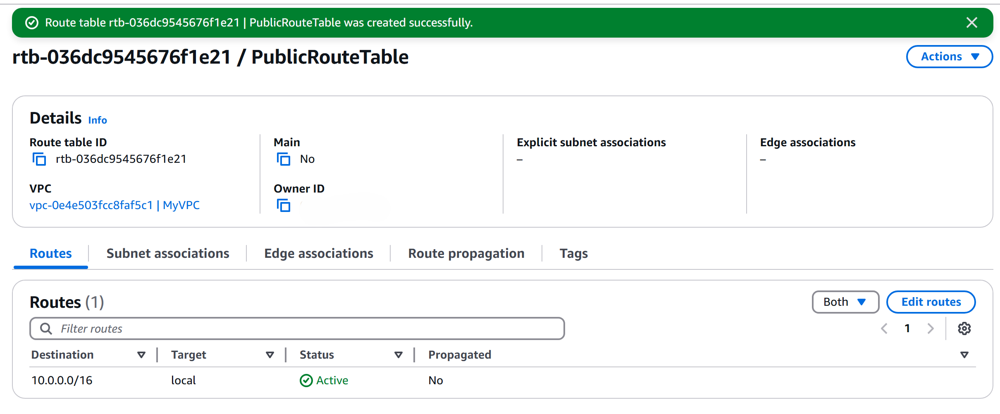

---

### 8. Add the Internet Gateway Route

1. Select **PublicRouteTable** and click the **Routes** tab
2. Click **Edit routes → Add route**
3. Configure:
   - **Destination:** `0.0.0.0/0`
   - **Target:** Internet Gateway → `MyIGW`
4. Click **Save changes**

> The route table now has 2 active routes: local VPC traffic and all other traffic directed to the Internet Gateway.

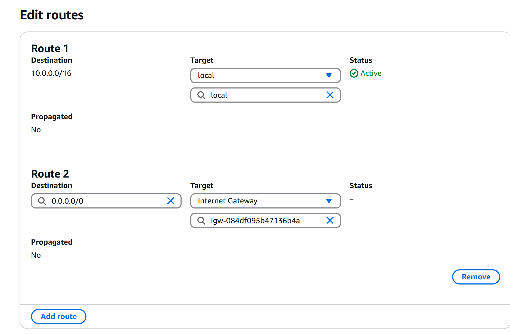

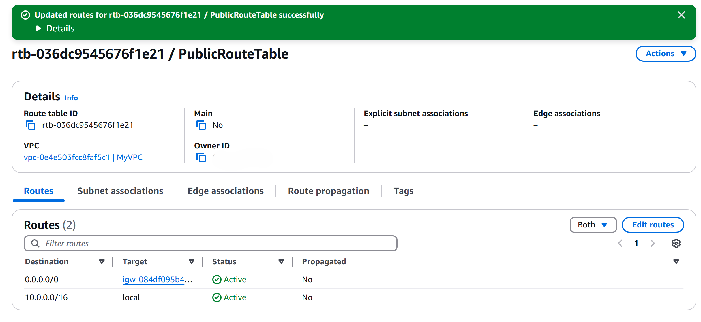

---

### 9. Associate the Public Subnet with the Public Route Table

1. In **PublicRouteTable**, click the **Subnet associations** tab
2. Click **Edit subnet associations**
3. Select **MyPublicSubnet**
4. Click **Save associations**

> You should see: *"You have successfully updated subnet associations for PublicRouteTable"* with `MyPublicSubnet` now listed under Explicit subnet associations.

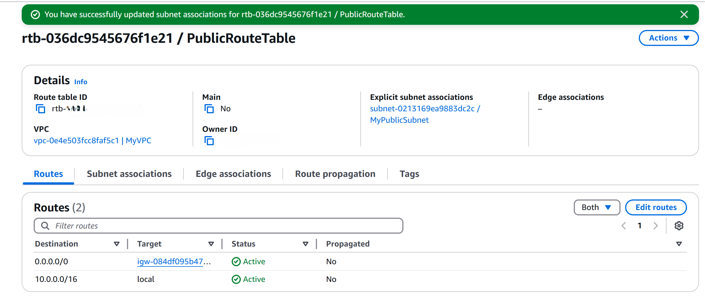

---

### 10. Create the NAT Gateway

1. Navigate to **VPC → NAT Gateways → Create NAT gateway**
2. Configure:
   - **Name:** `MyNATGateway`
   - **Subnet:** `MyPublicSubnet` *Must be the **public** subnet*
   - **Connectivity type:** Public
   - **Elastic IP:** Click **Allocate Elastic IP**
3. Click **Create NAT gateway**

> he NAT Gateway will show **Pending** status, wait 1–2 minutes for it to become **Available** before proceeding.

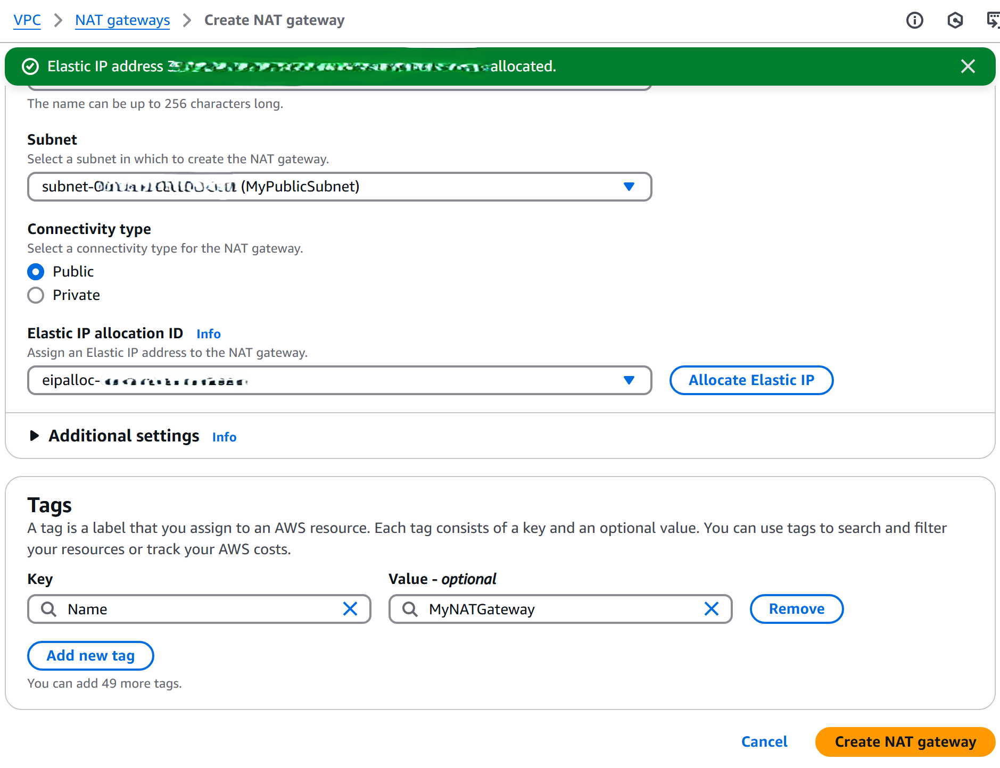

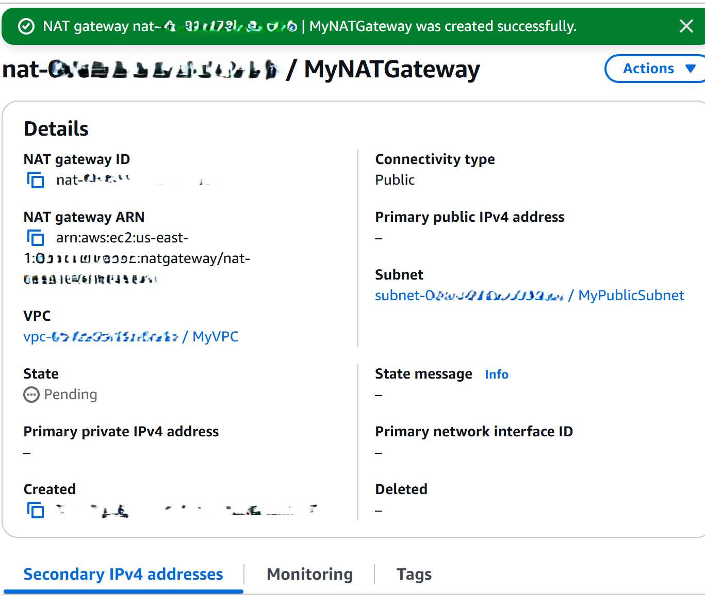

---

### 11. Update the Private Route Table

Direct private subnet traffic through the NAT Gateway by updating the **main** route table (which the private subnet uses by default).

1. Navigate to **VPC → Route Tables**
2. Select the **main** route table for MyVPC (the one marked **Main: Yes**)
3. Click **Routes → Edit routes → Add route**
4. Configure:
   - **Destination:** `0.0.0.0/0`
   - **Target:** NAT Gateway → `MyNATGateway`
5. Click **Save changes**

> The private route table now has 2 routes: local VPC traffic and outbound traffic directed to the NAT Gateway.


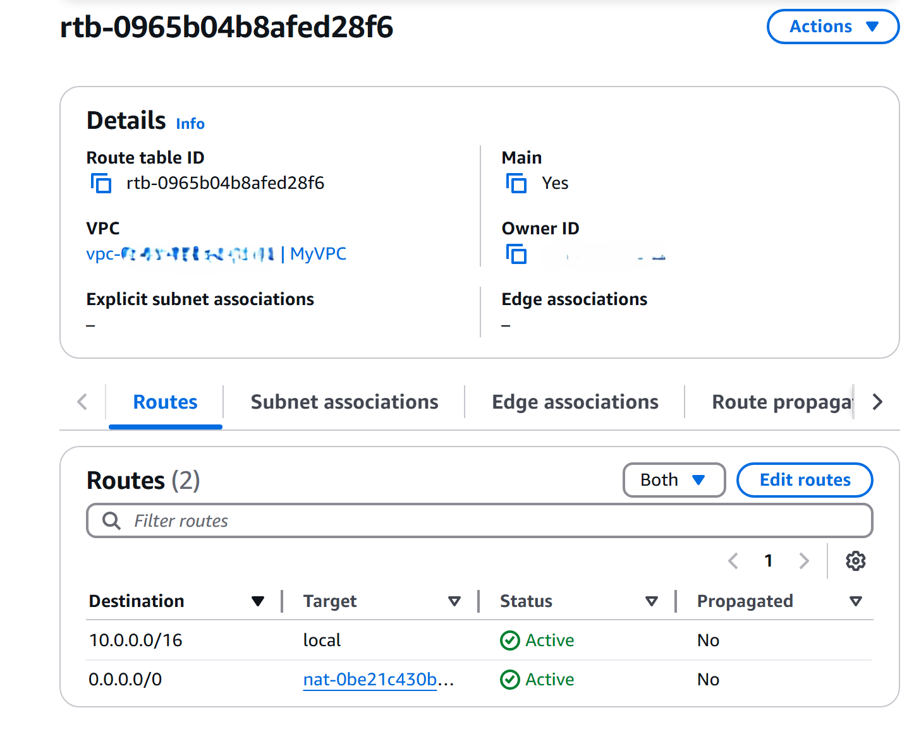

---

### 12. Launch EC2 Instances

#### Public EC2 Instance (Bastion / Jump Box)

1. Navigate to **EC2 → Instances → Launch instances**
2. Configure:
   - **Name:** `MyPublicServer`
   - **AMI:** Amazon Linux 2023
   - **Instance type:** `t2.micro`
   - **Key pair:** Select your key pair
   - **Network settings:**
     - **VPC:** `MyVPC`
     - **Subnet:** `MyPublicSubnet`
     - **Auto-assign public IP:** Enable
   - **Security group:** Create new `MyEC2Server_SG`

> Once launched, verify the instance has a public IP (e.g., `52.206.8.68`).

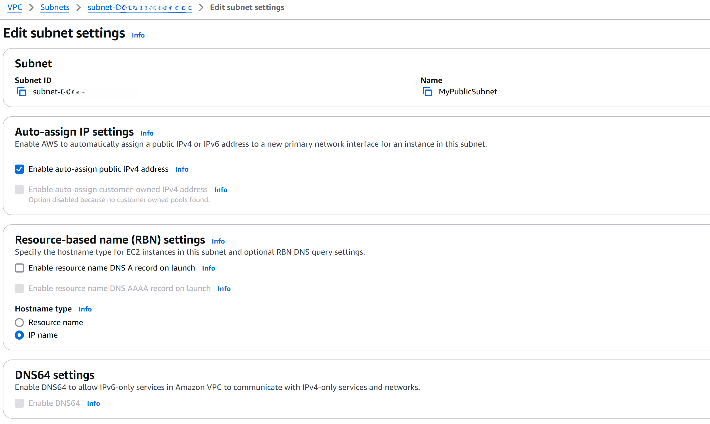

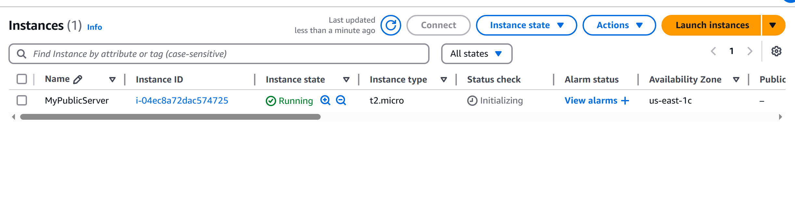

#### Private EC2 Instance

1. Launch a second instance with:
   - **Name:** `MyPrivateServer`
   - **Subnet:** `MyPrivateSubnet`
   - **Auto-assign public IP:** Disable
   - **Security group:** Allow SSH from `MyPublicSubnet` CIDR (`10.0.0.0/24`) only


---

### 13. Connect to Public Instance & Verify NAT

#### Connect via EC2 Instance Connect

1. Select **MyPublicServer → Connect → EC2 Instance Connect**
2. Click **Connect**

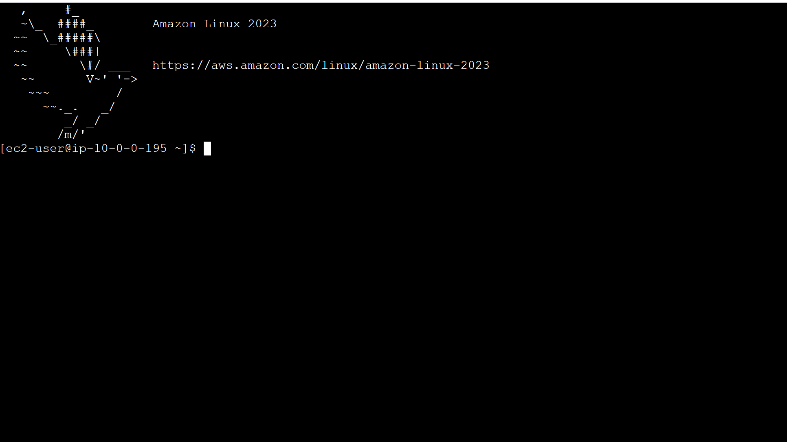

#### Run system updates (proves internet connectivity)

```bash
sudo su
yum -y update
```

> A successful update confirms the public instance has internet access via the Internet Gateway.


#### SSH to Private Instance (via the Public Instance as a jump box)

From the public instance terminal:

```bash
# Copy your key file content into a .pem file
vi MyKey.pem
# Paste your private key, save and exit (:wq)

# Set correct permissions
chmod 400 MyKey.pem

# SSH to the private instance using its private IP
ssh -i MyKey.pem ec2-user@<private-instance-private-ip>
```

Once connected to the private instance, run:

```bash
sudo su
yum -y update
```

> A successful update from the **private** instance confirms the NAT Gateway is routing outbound traffic correctly.

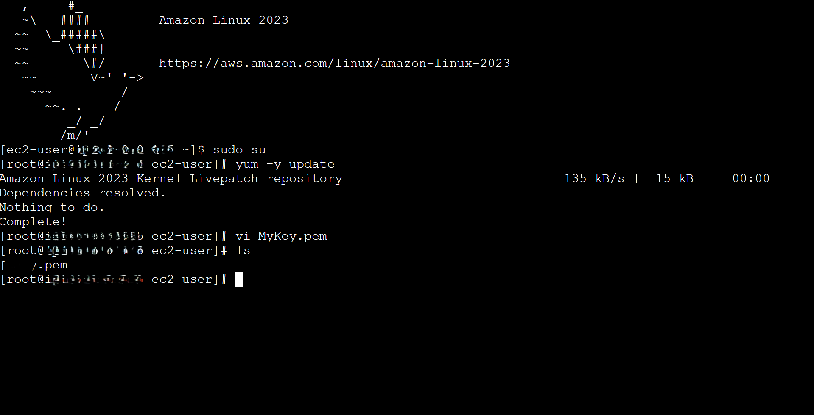

---

## Resource Summary

| Resource | Name | Value |
|---|---|---|
| VPC | MyVPC | `10.0.0.0/16` |
| Public Subnet | MyPublicSubnet | `10.0.0.0/24` |
| Private Subnet | MyPrivateSubnet | `10.0.1.0/24` |
| Internet Gateway | MyIGW | Attached to MyVPC |
| Public Route Table | PublicRouteTable | `0.0.0.0/0 → MyIGW` |
| Main Route Table | (auto-created) | `0.0.0.0/0 → MyNATGateway` |
| NAT Gateway | MyNATGateway | In MyPublicSubnet |
| Public EC2 | MyPublicServer | `t2.micro`, has public IP |
| Private EC2 | MyPrivateServer | `t2.micro`, private IP only |

---

## Cleanup

> **Important:** NAT Gateways and Elastic IPs incur hourly charges. Delete resources when done to avoid unexpected costs.

Delete in this order to avoid dependency errors:

1. **Terminate EC2 instances** (EC2 → Instances → Terminate)
2. **Delete the NAT Gateway** (VPC → NAT Gateways → Delete)
3. **Release the Elastic IP** (EC2 → Elastic IPs → Release)
4. **Detach and delete the Internet Gateway** (VPC → Internet Gateways → Detach, then Delete)
5. **Delete custom Route Tables** (VPC → Route Tables → Delete `PublicRouteTable`)
6. **Delete Subnets** (VPC → Subnets → Delete both subnets)
7. **Delete the VPC** (VPC → Your VPCs →  Delete)

---

## Key Concepts

| Term | Definition |
|---|---|
| **VPC** | Virtual Private Cloud: an isolated, logically-defined network in AWS |
| **Subnet** | A range of IP addresses within a VPC; can be public or private |
| **Internet Gateway (IGW)** | Enables bidirectional communication between a VPC and the internet |
| **NAT Gateway** | Allows private instances to initiate outbound internet connections only |
| **Route Table** | A set of rules that determine where network traffic is directed |
| **Elastic IP** | A static public IPv4 address; required by NAT Gateway |
| **CIDR Block** | IP address range notation (e.g., `10.0.0.0/16` = 65,536 addresses) |
| **Bastion Host** | A public-facing instance used as a secure jump box to reach private instances |

---

## Resources

- [AWS NAT Gateway Documentation](https://docs.aws.amazon.com/vpc/latest/userguide/vpc-nat-gateway.html)
- [Amazon VPC User Guide](https://docs.aws.amazon.com/vpc/latest/userguide/what-is-amazon-vpc.html)
- [EC2 Key Pairs](https://docs.aws.amazon.com/AWSEC2/latest/UserGuide/ec2-key-pairs.html)
- [VPC Pricing](https://aws.amazon.com/vpc/pricing/)
- [AWS Free Tier](https://aws.amazon.com/free/)

---

> ** Cost Estimate:** NAT Gateway ~$0.045/hr + $0.045/GB data processed. Elastic IP: free while attached, ~$0.005/hr when unattached. Always clean up all AWS resources when finished to avoid charges. 